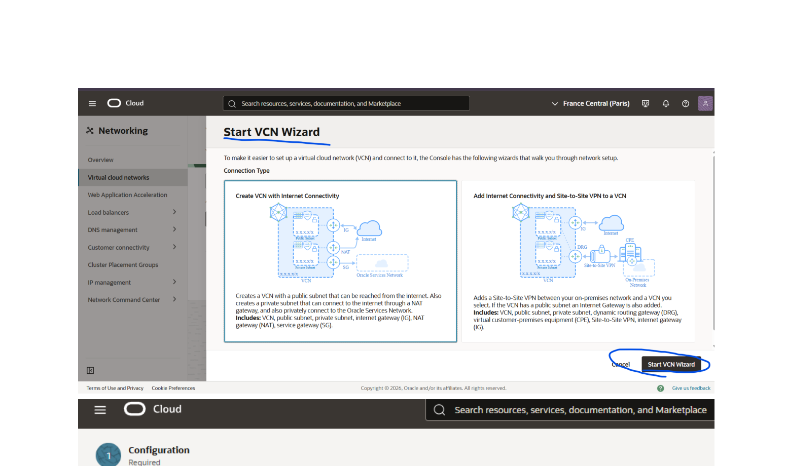
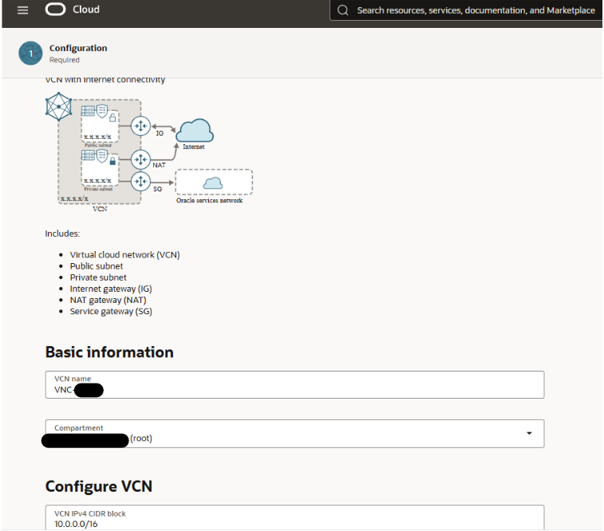
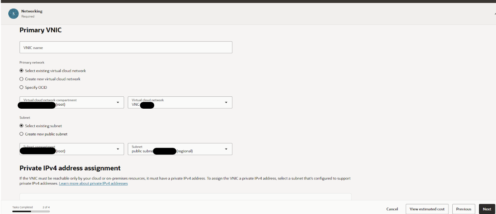
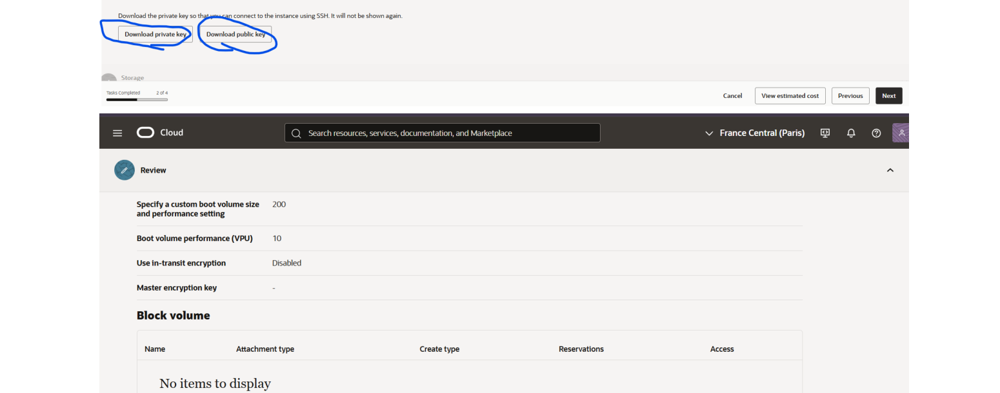
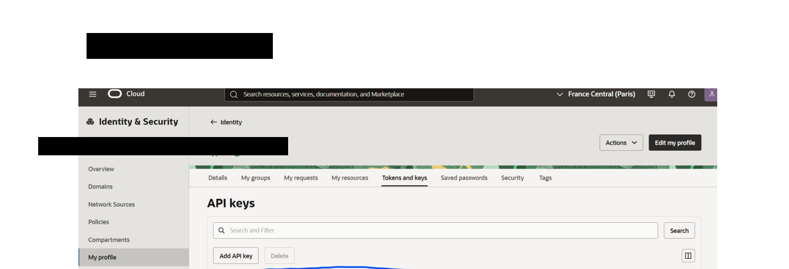
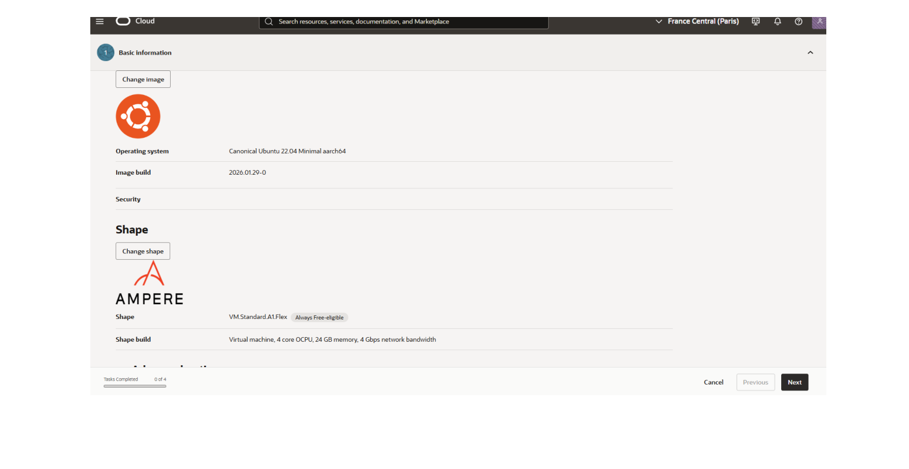
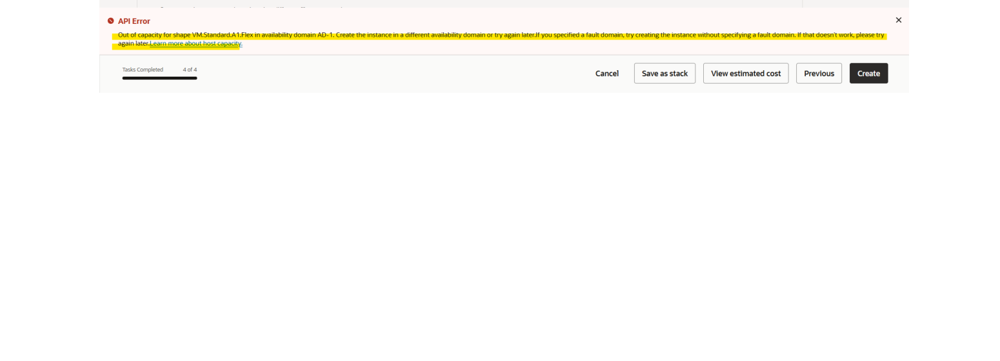

# 📖 Documentación del Proyecto — OCI Resilient Provisioner

> **Autor:** David  
> **Fecha de creación:** Febrero 2026  
> **Última actualización de documentación:** Abril 2026

---

## 📋 Índice

1. [Descripción General](#1-descripción-general)
2. [Arquitectura del Proyecto](#2-arquitectura-del-proyecto)
3. [Estructura de Archivos](#3-estructura-de-archivos)
4. [Requisitos Previos](#4-requisitos-previos)
5. [Configuración del Entorno](#5-configuración-del-entorno)
6. [Ficheros de Configuración](#6-ficheros-de-configuración)
7. [Funcionamiento del Script Principal](#7-funcionamiento-del-script-principal)
8. [Comandos de Telegram](#8-comandos-de-telegram)
9. [Flujo de Ejecución](#9-flujo-de-ejecución)
10. [Gestión de Errores](#10-gestión-de-errores)
11. [Seguridad y Buenas Prácticas](#11-seguridad-y-buenas-prácticas)
12. [Notas Técnicas](#12-notas-técnicas)
13. [Guía: Obtención de Claves API de Oracle Cloud](#13-guía-obtención-de-claves-api-de-oracle-cloud)
14. [Resultado Final — Prueba de Funcionamiento](#14-resultado-final--prueba-de-funcionamiento)

---

## 1. Descripción General

**OCI Resilient Provisioner** es una herramienta de automatización en Python diseñada para gestionar el aprovisionamiento de instancias **ARM A1.Flex** en **Oracle Cloud Infrastructure (OCI)** de forma tolerante a fallos.

### ¿Por qué es necesario?

En entornos de alta demanda (como las capas *Free Tier* o zonas de alta saturación), las peticiones de aprovisionamiento suelen ser rechazadas por falta de recursos físicos en el centro de datos (Error de API: *"Out of host capacity"*). Esta herramienta resuelve el problema implementando un motor de reintentos inteligente con gestión de *Rate Limiting* (429) y alertas en tiempo real vía Telegram, asegurando el despliegue exitoso de la infraestructura sin intervención manual continua.

### Características Principales

| Característica | Detalle |
|---|---|
| **Tipo de instancia** | VM.Standard.A1.Flex |
| **Recursos** | 4 OCPUs / 24 GB RAM / 200 GB Boot Volume |
| **Región** | eu-paris-1 (París, Francia) |
| **Control remoto** | Bot de Telegram con comandos interactivos |
| **Descubrimiento de ADs** | Automático vía API (no hardcodeado) |
| **Versión** | v2.2 |

---

\newpage

## 2. Arquitectura del Proyecto


```
┌─────────────────────────────────────────────────────────────┐
│                    OCI Resilient Provisioner                │
│                                                             │
│  ┌──────────────┐    ┌──────────────┐    ┌──────────────┐   │
│  │   Telegram   │◄──►│ Bot Handler  │◄──►│   Deployer   │   │
│  │   (Usuario)  │    │  (Comandos)  │    │    (Hilo)    │   │
│  └──────────────┘    └──────────────┘    └──────┬───────┘   │
│                                                 │           │
│                              ┌──────────────────┘           │
│                              ▼                              │
│                    ┌──────────────────┐                     │
│                    │   OCI SDK (API)  │                     │
│                    │  - Identity      │                     │
│                    │  - Compute       │                     │
│                    └────────┬─────────┘                     │
│                             │                               │
│                             ▼                               │
│                    ┌──────────────────┐                     │
│                    │  Oracle Cloud    │                     │
│                    │  Infrastructure  │                     │
│                    └──────────────────┘                     │
└─────────────────────────────────────────────────────────────┘
```

### Modelo de Concurrencia

El bot utiliza **dos hilos**:

1. **Hilo principal** — Ejecuta el polling de Telegram (`bot.infinity_polling`) y procesa los comandos del usuario.
2. **Hilo deployer** (`daemon=True`) — Ejecuta el bucle de intentos de creación de instancia. Se lanza/pausa bajo demanda desde Telegram.

Ambos hilos comparten estado global protegido por un `threading.Lock`.

---

## 3. Estructura de Archivos

```
projecto-oracle/
│
├── 📄 documentacion(a medias).pdf          # Documentación previa incompleta
│
├── 📁 claves-api/                          # Credenciales OCI + bot
│   ├── deployer.py                         # Script principal (450 líneas)
│   ├── .env                                # Variables de entorno (secretos)
│   ├── api.txt                             # Config OCI SDK (perfil DEFAULT)
│   ├── instances.txt                       # IDs de recursos OCI (compartment, subnet, imagen)
│   ├── ********@gmail.com-****-**-**T**_**_**.pem       # Clave PRIVADA API (RSA)
│   └── ********@gmail.com-****-**-**T**_**_**_public.pem # Clave PÚBLICA API (RSA)
│
└── 📁 claves-ssh/                           # Par de claves SSH para la instancia
    ├── ssh-key-2026-02-23.key              # Clave PRIVADA SSH (RSA)
    └── ssh-key-2026-02-23.key.pub          # Clave PÚBLICA SSH
```
\newpage

### Descripción de cada fichero

| Archivo | Propósito | Sensible |
|---|---|:---:|
| `deployer.py` | Script principal del bot deployer | No |
| `.env` | Token de Telegram, Chat ID, rutas a ficheros | ⚠️ **SÍ** |
| `api.txt` | Configuración del SDK de OCI (user OCID, fingerprint, tenancy, región, ruta de clave) | ⚠️ **SÍ** |
| `instances.txt` | IDs de compartment, subnet e imagen para la instancia | ⚠️ **SÍ** |
| `*.pem` | Par de claves RSA para autenticación con la API de OCI | 🔴 **CRÍTICO** |
| `ssh-key-*.key` | Clave privada SSH para acceder a la instancia creada | 🔴 **CRÍTICO** |
| `ssh-key-*.key.pub` | Clave pública SSH inyectada en la instancia al crearla | ⚠️ **SÍ** |

---

## 4. Requisitos Previos

### Software

- **Python 3.8+**
- **pip** (gestor de paquetes de Python)

### Dependencias Python

```bash
pip install oci pyTelegramBotAPI python-dotenv
```

| Paquete | Versión mínima | Propósito |
|---|---|---|
| `oci` | — | SDK oficial de Oracle Cloud Infrastructure |
| `pyTelegramBotAPI` | — | Librería para bots de Telegram (`telebot`) |
| `python-dotenv` | — | Carga de variables desde fichero `.env` |

### Cuentas y Servicios Externos

1. **Cuenta de Oracle Cloud** (nivel gratuito / Always Free Tier)
   - Tenancy configurado
   - VCN + Subnet creados
   - Imagen compatible con ARM seleccionada
   - API Key generada y registrada

2. **Bot de Telegram**
   - Creado a través de [@BotFather](https://t.me/BotFather)
   - Token del bot obtenido
   - Chat ID del usuario obtenido vía [@userinfobot](https://t.me/userinfobot)

---

## 5. Configuración del Entorno

### 5.1 Fichero `.env`

Crear un fichero `.env` en la misma carpeta que `deployer.py`:

```env
# ─────────────────────────────────────────────────────────────
#  OCI Resilient Provisioner — Fichero de configuración
#  NUNCA subas este fichero a GitHub ni lo compartas.
#  Añádelo a tu .gitignore: echo ".env" >> .gitignore
# ─────────────────────────────────────────────────────────────

# Tu token del bot de Telegram (obtenido de @BotFather)
TELEGRAM_TOKEN=<TU_TOKEN_DE_TELEGRAM>

# Tu ID de chat personal (obtenido de @userinfobot)
TELEGRAM_CHAT_ID=<TU_CHAT_ID>

# Rutas a tus ficheros de Oracle
OCI_CONFIG_PATH=api.txt
OCI_INSTANCES_PATH=instances.txt
OCI_SSH_KEY_PATH=ssh-key-2026-02-23.key.pub
```

> [!CAUTION]
> **Nunca** subas el fichero `.env` a un repositorio público. Contiene tokens y credenciales que permitirían a terceros controlar tu bot y acceder a tus recursos en la nube.

### 5.2 Variables de Entorno Requeridas

| Variable | Descripción | Ejemplo |
|---|---|---|
| `TELEGRAM_TOKEN` | Token del bot de Telegram | `123456789:ABCdefGHI...` |
| `TELEGRAM_CHAT_ID` | ID numérico del chat autorizado | `123456789` |
| `OCI_CONFIG_PATH` | Ruta al fichero de config OCI (`api.txt`) | `api.txt` o ruta absoluta |
| `OCI_INSTANCES_PATH` | Ruta al fichero de instancias (`instances.txt`) | `instances.txt` o ruta absoluta |
| `OCI_SSH_KEY_PATH` | Ruta a la clave pública SSH | `ssh-key-2026-02-23.key.pub` |

---

## 6. Ficheros de Configuración

### 6.1 `api.txt` — Configuración del SDK OCI

Este fichero sigue el formato estándar del SDK de OCI:

```ini
[DEFAULT]
user=ocid1.user.oc1..****************************
fingerprint=**:**:**:**:**:**:**:**:**:**:**:**:**:**:**:**
tenancy=ocid1.tenancy.oc1..****************************
region=eu-paris-1
key_file=C:/ruta/a/tu/clave_privada.pem
```

| Campo | Descripción |
|---|---|
| `user` | OCID del usuario de OCI |
| `fingerprint` | Huella digital de la API Key registrada |
| `tenancy` | OCID del tenancy |
| `region` | Región de Oracle Cloud (ej: `eu-paris-1`) |
| `key_file` | Ruta absoluta al fichero `.pem` con la clave privada de la API |

### 6.2 `instances.txt` — Parámetros de la Instancia

```
availabilityDomain: "<REGION>-AD-1"
compartmentId: "ocid1.tenancy.oc1..****************************"
subnetId: "ocid1.subnet.oc1.<region>.****************************"
imageId: "ocid1.image.oc1.<region>.****************************"
```

| Campo | Descripción |
|---|---|
| `availabilityDomain` | Dominio de disponibilidad (se descubre automáticamente vía API en v2.2) |
| `compartmentId` | OCID del compartment donde se creará la instancia |
| `subnetId` | OCID de la subnet de la VCN |
| `imageId` | OCID de la imagen del SO (ej: Oracle Linux, Ubuntu ARM) |

> [!NOTE]
> Desde la versión v2.2, el campo `availabilityDomain` del fichero `instances.txt` **no se usa directamente**. Los ADs se descubren automáticamente consultando la API de Identity de Oracle. Esto resuelve problemas de versiones anteriores donde los nombres se construían manualmente y podían ser incorrectos.

### 6.3 Claves Criptográficas

#### Claves API (PEM)

- **Clave privada** (`*.pem`): Usada por el SDK de OCI para firmar las peticiones a la API REST de Oracle. **Nunca compartir.**
- **Clave pública** (`*_public.pem`): Registrada en la consola de OCI bajo el perfil del usuario → API Keys.

#### Claves SSH

- **Clave privada** (`ssh-key-*.key`): Usada para conectarse por SSH a la instancia una vez creada.
- **Clave pública** (`ssh-key-*.key.pub`): Inyectada en la instancia durante su creación como `ssh_authorized_keys` en los metadatos.

---

## 7. Funcionamiento del Script Principal

### Estructura del Código (`deployer.py`)

El script está organizado en **8 secciones lógicas**:

```
Sección 0 — Carga de secretos desde .env
Sección 1 — Validación de arranque
Sección 2 — Estado global (protegido con Lock)
Sección 3 — Bot de Telegram (handlers de comandos)
Sección 4 — Extracción de variables del fichero de instancias
Sección 5 — Descubrimiento de Availability Domains vía API
Sección 6 — Constructor de LaunchInstanceDetails
Sección 7 — Motor principal (el deployer)
Sección 8 — Punto de entrada
```

### 7.1 Sección 0 — Carga de Secretos

```python
load_dotenv()
TELEGRAM_TOKEN      = os.getenv("TELEGRAM_TOKEN")
TELEGRAM_CHAT_ID    = os.getenv("TELEGRAM_CHAT_ID")
CONFIG_FILE_PATH    = os.getenv("OCI_CONFIG_PATH")
INSTANCES_FILE_PATH = os.getenv("OCI_INSTANCES_PATH")
SSH_PUBLIC_KEY_PATH = os.getenv("OCI_SSH_KEY_PATH")
```

Carga las variables del fichero `.env` al entorno de Python.

### 7.2 Sección 1 — Validación de Arranque

Si falta **cualquier** variable de entorno, el script se detiene inmediatamente con `SystemExit` y un mensaje descriptivo.

### 7.3 Sección 2 — Estado Global

Variables compartidas entre el hilo del bot y el hilo deployer:

| Variable | Tipo | Propósito |
|---|---|---|
| `script_corriendo` | `bool` | Flag de control de ejecución del bucle deployer |
| `ultima_respuesta` | `str` | Último evento registrado (para `/estado`) |
| `total_intentos` | `int` | Contador acumulado de intentos |
| `inicio_timestamp` | `datetime` | Marca temporal de inicio del proceso |
| `_hilo_deployer` | `Thread` | Referencia al hilo daemon del deployer |

Todas las operaciones de lectura/escritura están protegidas por `threading.Lock()`.

### 7.4 Sección 3 — Bot de Telegram

Ver sección [8. Comandos de Telegram](#8-comandos-de-telegram).

### 7.5 Sección 4 — Extracción de Variables

La función `extraer_variables_de_instancia()` parsea el fichero `instances.txt` con expresiones regulares para extraer:
- `compartmentId`
- `subnetId`
- `imageId`

### 7.6 Sección 5 — Descubrimiento de ADs

```python
def obtener_availability_domains(config, compartment_id):
    identity_client = oci.identity.IdentityClient(config)
    response = identity_client.list_availability_domains(compartment_id=compartment_id)
    return [ad.name for ad in response.data]
```

Consulta la API de Identity de Oracle para obtener los Availability Domains **reales** de la región. Esto es una mejora clave de la v2.2:

- **Regiones con 1 AD** (París, Madrid, Milán...): Devuelve 1 elemento.
- **Regiones con 3 ADs** (Frankfurt, Ashburn...): Devuelve 3 elementos.

### 7.7 Sección 6 — Constructor de Instancia

La función `construir_detalles()` crea un objeto `LaunchInstanceDetails` con la configuración fija:

```python
shape="VM.Standard.A1.Flex"
ocpus=4
memory_in_gbs=24
boot_volume_size_in_gbs=200
assign_public_ip=True
display_name="DAVID-SERVER-ARM"
```

### 7.8 Sección 7 — Motor Principal (El deployer)

El bucle principal del deployer:

1. Carga la configuración OCI y crea los clientes
2. Descubre los ADs disponibles vía API
3. Entra en un bucle infinito que:
   - Rota entre los ADs disponibles (round-robin)
   - Intenta lanzar la instancia con `compute_client.launch_instance()`
   - Si **tiene éxito**: notifica por Telegram y termina el bucle
   - Si **falla**: gestiona el error según el tipo (ver sección 10)

---

## 8. Comandos de Telegram

El bot solo responde al **chat ID autorizado** (filtro de seguridad `_usuario_autorizado()`).

| Comando | Descripción | Respuesta |
|---|---|---|
| `/reanudar` | Inicia o reanuda el despliegue | ▶️ Lanza el hilo deployer si no está activo |
| `/parar` | Pausa el despliegue | 🛑 Marca `script_corriendo = False`; el hilo termina al final del ciclo actual (máx ~145s) |
| `/estado` | Muestra estado actual | 📊 Estado (🟢/🟡/🔴), intentos, tiempo activo, último evento |
| `/ayuda` | Lista de comandos | 🤖 Muestra todos los comandos disponibles |
| `/start` | Alias de `/estado` | Igual que `/estado` |

### Indicadores de Estado

| Icono | Estado | Significado |
|---|---|---|
| 🟢 | DESPLEGANDO ACTIVAMENTE | El hilo deployer está corriendo y `script_corriendo = True` |
| 🟡 | PARANDO | Se pidió parar pero el hilo aún está terminando el ciclo actual |
| 🔴 | DETENIDO | El hilo deployer no está activo |

### Notificaciones Automáticas

El bot envía notificaciones proactivas en estos eventos:

- **🚀 Arranque** — Confirma que el bot está en línea al iniciar el script
- **🚨 ÉXITO** — Instancia ARM creada con éxito (incluye AD e intentos totales)
- **⚠️ LimitExceeded** — Oracle indica que ya se alcanzó el límite de instancias ARM
- **💀 Error de arranque** — El deployer no pudo inicializarse

---

## 9. Flujo de Ejecución

```
                    ┌──────────────────┐
                    │   python main()  │
                    └────────┬─────────┘
                             │
                    ┌────────▼─────────┐
                    │  Cargar .env     │
                    │  Validar vars    │
                    └────────┬─────────┘
                             │
                    ┌────────▼─────────────┐
                    │  Conectar a Telegram │
                    │  Enviar msg "en      │
                    │  línea" al usuario   │
                    └────────┬─────────────┘
                             │
                    ┌────────▼─────────┐
                    │  infinity_polling │◄─── Espera comandos
                    └────────┬─────────┘
                             │
              ┌──── /reanudar recibido ────┐
              │                            │
     ┌────────▼──────────┐                 │
     │  Lanzar hilo      │                 │
     │  deployer (daemon)│                 │
     └────────┬──────────┘                 │
              │                            │
     ┌────────▼──────────┐                 │
     │ Cargar config OCI │                 │
     │ Descubrir ADs     │                 │
     └────────┬──────────┘                 │
              │                            │
     ┌────────▼──────────────┐             │
     │ BUCLE: para cada AD   │             │
     │   launch_instance()   │             │
     │                       │◄────────────┘
     │  ¿Éxito? ─────► 🎉 Notificar y FIN  │
     │  ¿Out of capacity? ──► Esperar      │
     │                        125-145s     │
     │  ¿Rate limit 429? ───► Esperar 3min │
     │  ¿LimitExceeded? ────► FIN          │
     │  ¿Otro error? ───────► Esperar 60s  │
     └──────────────────────┘
```

---

## 10. Gestión de Errores

### Errores de la API de Oracle (ServiceError)

| Código HTTP | Condición | Acción | Espera |
|---|---|---|---|
| `500` | `Out of host capacity` | Reintentar en otro AD | 125-145s (aleatorio) |
| `429` | Rate limiting | Enfriamiento | 180s (3 minutos) |
| `400` | `LimitExceeded` | Detener el deployer | — (fin) |
| Otro | Cualquier otro `ServiceError` | Reintentar | 60s |

### Otros Errores

| Tipo | Acción | Espera |
|---|---|---|
| Error de arranque (`Exception` durante init) | Notificar por Telegram, detener | — (fin) |
| Error genérico en el bucle (`Exception`) | Reintentar | 60s |
| Error de conexión a Telegram | Reconexión automática | 15s |

### Tiempos de Espera (Resumen)

```
Out of host capacity:  125 – 145 segundos (aleatorio para evitar patrones)
Rate limit (429):      180 segundos (3 minutos)
Error genérico:         60 segundos
Fallo de polling:       15 segundos
```

---

## 11. Seguridad y Buenas Prácticas

### ✅ Medidas de Seguridad Implementadas

1. **Separación de secretos** — Todas las credenciales están en `.env`, separadas del código.
2. **Filtro de usuario** — Solo el `TELEGRAM_CHAT_ID` configurado puede enviar comandos al bot (función `_usuario_autorizado()`).
3. **Validación al arranque** — Si falta cualquier variable, el script no inicia.
4. **Advertencias en el código** — Comentarios explícitos recordando no compartir el `.env`.

### ⚠️ Recomendaciones Adicionales

1. **Añadir `.env` y claves a `.gitignore`:**
   ```gitignore
   .env
   *.pem
   *.key
   *.key.pub
   api.txt
   instances.txt
   ```

2. **Rotar credenciales** periódicamente:
   - API Keys de OCI
   - Token del bot de Telegram
   - Claves SSH

3. **No almacenar claves privadas en el mismo directorio que el script** en entornos de producción. Usar un gestor de secretos o al menos permisos restrictivos.

4. **Limitar los permisos del usuario OCI** al mínimo necesario (solo acceso a `Compute` e `Identity`).

---

## 12. Notas Técnicas

### Versiones Anteriores y Mejoras

| Versión | Cambio Principal |
|---|---|
| v2.0 | Primera versión con control por Telegram |
| v2.1 | Intentos de construir nombres de ADs matemáticamente (problemático) |
| **v2.2** | **Descubrimiento real de ADs vía API** — Los ADs se consultan dinámicamente, eliminando errores por nombres incorrectos. Compatible con cualquier región sin modificar código. |

### Especificaciones de la Instancia Solicitada

| Parámetro | Valor |
|---|---|
| Shape | `VM.Standard.A1.Flex` |
| OCPUs | 4 |
| Memoria | 24 GB |
| Disco | 200 GB |
| IP Pública | Sí (asignada automáticamente) |
| Display Name | `DAVID-SERVER-ARM` |
| SO | Definido por `imageId` en `instances.txt` |

### Dependencias del Sistema

```
Python 3.8+
├── oci                  → SDK de Oracle Cloud Infrastructure
├── pyTelegramBotAPI     → Bot de Telegram (telebot)
├── python-dotenv        → Carga de .env
├── threading            → Concurrencia (stdlib)
├── logging              → Logs (stdlib)
├── re                   → Expresiones regulares (stdlib)
├── random               → Tiempos aleatorios de espera (stdlib)
├── time                 → Sleep (stdlib)
├── os                   → Variables de entorno (stdlib)
└── datetime             → Timestamps (stdlib)
```

---

## 13. Guía: Obtención de Claves API de Oracle Cloud

Esta sección detalla paso a paso cómo obtener las claves y configuraciones necesarias para que el deployer funcione.

### 13.1 Crear una Cuenta de Oracle Cloud

1. Ve a [cloud.oracle.com](https://cloud.oracle.com) y regístrate para una cuenta gratuita (*Always Free Tier*).
2. Completa el proceso de verificación (tarjeta de crédito para verificar identidad, **no se cobra**).
3. Selecciona tu **Home Region** (ej: `eu-paris-1` para Francia). Una vez elegida, no se puede cambiar.

### 13.2 Crear la Red Virtual (VCN)

Antes de crear la instancia, necesitas una **VCN (Virtual Cloud Network)** con una subnet pública.

1. En la consola de Oracle Cloud, ve a **Networking → Virtual Cloud Networks**.
2. Haz clic en **Start VCN Wizard**.



3. Selecciona **"Create VCN with Internet Connectivity"** y haz clic en **Start VCN Wizard**.
4. Rellena la información básica:
   - **VCN Name**: Un nombre descriptivo (ej: `VNC-MIPROYECTO`)
   - **Compartment**: Tu compartment root
   - **VCN IPv4 CIDR**: `10.0.0.0/16` (valor por defecto)



5. En la sección de **Networking → Primary VNIC**, selecciona la VCN y subnet públicas que acabas de crear:



### 13.3 Generar las Claves SSH

Durante la creación de la instancia (o antes), necesitas un par de claves SSH:

**Opción A — Desde la consola de Oracle (recomendado para principiantes):**

1. Al crear la instancia, en la sección **"Add SSH keys"**, selecciona **"Generate a key pair for me"**.
2. **Descarga AMBAS claves** (privada y pública). La clave privada **no se podrá volver a descargar**.



**Opción B — Desde tu terminal:**

```bash
ssh-keygen -t rsa -b 2048 -f ssh-key-$(date +%Y-%m-%d)
```

Esto genera:
- `ssh-key-YYYY-MM-DD` → Clave privada (guardar en `claves-ssh/`)
- `ssh-key-YYYY-MM-DD.pub` → Clave pública (guardar en `claves-ssh/`)

### 13.4 Obtener la API Key de Oracle

Esta es la clave que permite al deployer comunicarse con la API de Oracle Cloud.

1. En la consola de Oracle Cloud, haz clic en tu **icono de perfil** (esquina superior derecha).
2. Ve a **Identity & Security → My profile**.
3. En la pestaña **"Tokens and keys"**, busca la sección **"API keys"**.
4. Haz clic en **"Add API key"**.



5. Selecciona **"Generate API key pair"** y descarga:
   - **Clave privada** (`.pem`) → Guardar en `claves-api/`
   - **Clave pública** (`.pem`) → Se registra automáticamente en OCI

6. Oracle te mostrará un **"Configuration file preview"** con los datos que necesitas para `api.txt`:

```ini
[DEFAULT]
user=ocid1.user.oc1..aaaa...      # Tu User OCID
fingerprint=xx:xx:xx:xx:...        # Huella de la API Key
tenancy=ocid1.tenancy.oc1..aaaa... # Tu Tenancy OCID  
region=eu-paris-1                  # Tu región
key_file=C:/ruta/a/tu/clave.pem    # Ruta a la clave privada descargada
```

> [!TIP]
> **Copia este contenido directamente** a tu fichero `api.txt`. Solo necesitas ajustar la ruta de `key_file` a la ubicación real de tu clave `.pem`.

### 13.5 Obtener los IDs de Recursos para `instances.txt`

Necesitas tres OCIDs que se obtienen desde la consola de Oracle Cloud:

| Campo | Dónde encontrarlo |
|---|---|
| `compartmentId` | **Identity → Compartments** → Copia el OCID de tu compartment |
| `subnetId` | **Networking → Virtual Cloud Networks** → Tu VCN → **Subnets** → Copia el OCID de la subnet pública |
| `imageId` | **Compute → Custom Images** o durante la creación de instancia → Copia el OCID de la imagen ARM |

#### Selección de Imagen y Shape

Al crear una instancia manualmente (para obtener el `imageId`), selecciona:

- **Image**: Una imagen compatible con ARM (ej: `Canonical Ubuntu 22.04 Minimal aarch64`)
- **Shape**: `VM.Standard.A1.Flex` (marcado como *Always Free-eligible*)



> [!NOTE]
> Al intentar crear la instancia manualmente, es muy probable que recibas el error **"Out of capacity"**. Esto es precisamente lo que deployer.py resuelve automatizando los reintentos.



### 13.6 Resumen de Ficheros a Configurar

Una vez completados todos los pasos, deberías tener:

```
claves-api/
├── deployer.py          # Ya incluido en el proyecto
├── .env                      # Creado manualmente (ver sección 5)
├── api.txt                   # Copiado del "Configuration file preview"
├── instances.txt             # OCIDs obtenidos de la consola
├── tu_clave_privada.pem      # Descargada al crear la API Key
└── tu_clave_publica.pem      # Se registra en OCI automáticamente

claves-ssh/
├── ssh-key-YYYY-MM-DD.key    # Clave privada SSH
└── ssh-key-YYYY-MM-DD.key.pub # Clave pública SSH
```

---

## 14. Resultado Final — Prueba de Funcionamiento

### ✅ ¡Misión Cumplida!

OCI Resilient Provisioner **completó su objetivo con éxito**, consiguiendo aprovisionar la instancia ARM A1.Flex en el Availability Domain `iKMY:EU-PARIS-1-AD-1` tras **4.744 intentos automatizados**.

A continuación se muestra la notificación real recibida en Telegram confirmando la creación de la máquina:


### Datos del Éxito

| Dato | Valor |
|---|---|
| **Región** | `eu-paris-1` (Francia Central, París) |
| **Availability Domain** | `iKMY:EU-PARIS-1-AD-1` |
| **Total de intentos** | 4.744 |
| **Tipo de instancia** | VM.Standard.A1.Flex (4 OCPUs / 24 GB RAM) |
| **Resultado** | 🎉 Instancia creada con éxito |

> [!IMPORTANT]
> OCI Resilient Provisioner automatiza un proceso que manualmente requeriría hacer clic en "Create" miles de veces, esperando a que Oracle libere capacidad en la región. Con 4.744 intentos y un promedio de ~135 segundos entre intentos, el proceso total tomó aproximadamente **7-8 días de ejecución continua**.

---

> [!IMPORTANT]
> Esta documentación ha sido generada con todos los **datos sensibles redactados** (tokens, OCIDs, claves criptográficas, huellas digitales, etc.). Para configurar el proyecto, sustituye los valores marcados con `<...>` o `****` por tus propias credenciales.

---

*Documentación generada automáticamente — Abril 2026*
